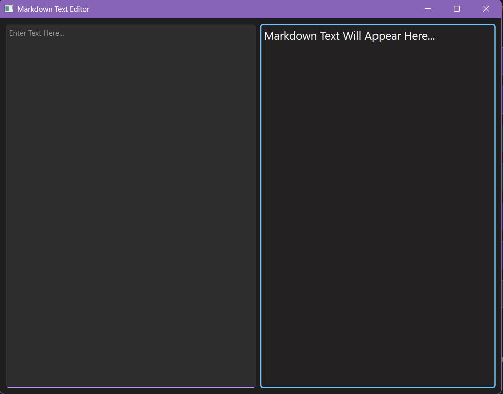
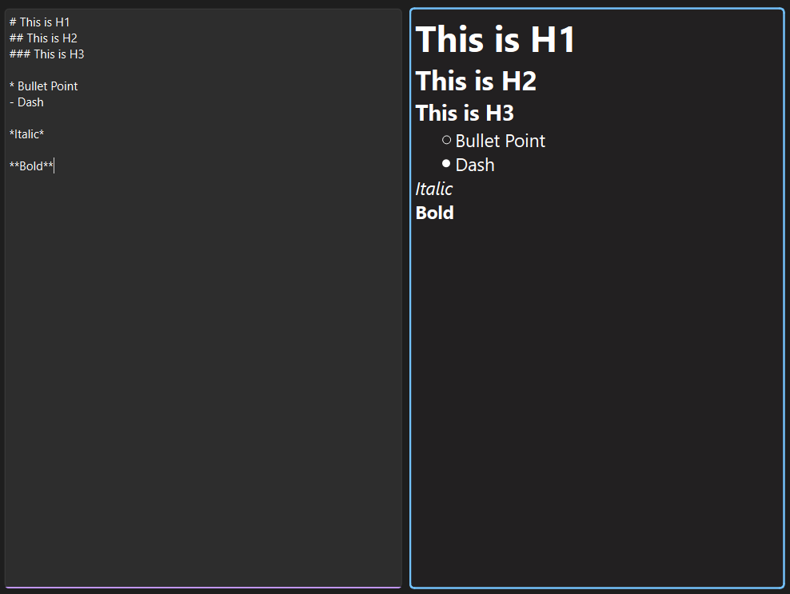

# Qt6 Markdown Text Editor
## Screenshots



## Features
* Text editor to the left
* Markdown display window to the right
* Updates in real time as you type

## Installation & Running
* Install Qt6: [Here](https://my.qt.io/download) (Sign-in Required)
* Change the directory in **CMakeLists.txt** to match your Qt6 directory
* Compile the project: ```cmake -S . -B build && cmake --build build```
* Run the project: ```./build/markdowntexteditor```

## Usage
* All you need to do is type in the left panel and the text will show up as you type

## Markdown Syntax Guide
### Body Text
* \*\*text** = Bold
* \*text* = Italics
* \*\*\*text*** = Bold & Italics
* \~\~\~text~~~ = Strikethrough

### Headers
* \# text = Heading 1
* \## text = Heading 2
* \### text = Heading 3
* \#### text = Heading 4
* \##### text = Heading 5
* \###### text = Heading 6

### Lists
#### Unordered Lists
* \* = Hollow Bullet Point
* \- = Solid Bullet Point
* \+ = Square Bullet Point

#### Ordered Lists
* 1\. text
* 2\. text
* ...
* 5\. text

### Links & Images
* \[text]\(https:\//your/link/here) = Link
* !\[text]\(your_image.png) = Image